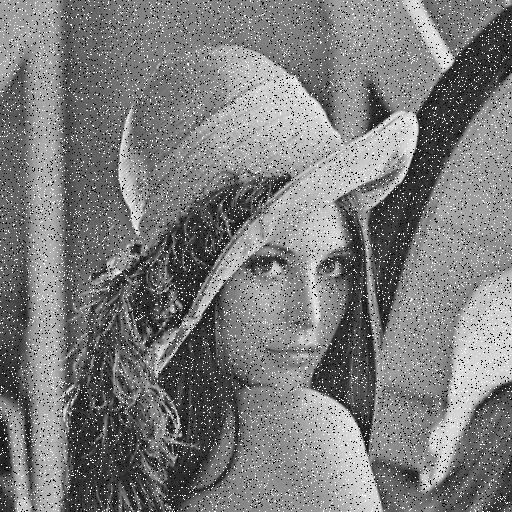
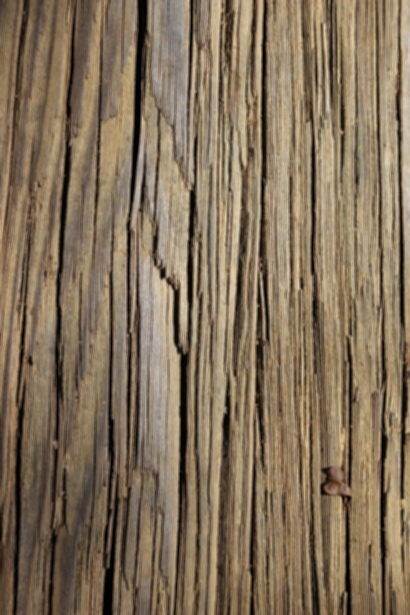
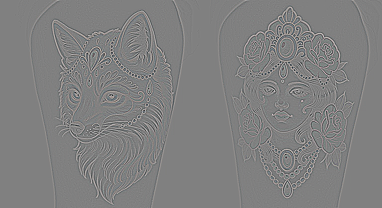

# Processador de Imagens BMP em C

Este é um projeto para a disciplina de Computação Visual, que implementa um processador de imagens em C (padrão C99). O programa é executado via linha de comando (CLI) e é capaz de aplicar diferentes filtros de processamento de imagem em arquivos BMP de 24 bits não comprimidos.

---

## Demonstração dos Filtros

O programa implementa quatro filtros distintos, cada um com uma finalidade específica. Abaixo estão os resultados de cada filtro aplicado a uma imagem de entrada apropriada.

### 1. Filtro de Mediana (`median`)
Ideal para remover ruído "sal e pimenta". O filtro substitui o pixel central pela mediana dos 9 pixels em sua vizinhança, preservando melhor as bordas do que um filtro de média.

| Imagem Original (com ruído) | Imagem Filtrada (Mediana) |
| :---: | :---: |
|  |  |

### 2. Filtro Passa-Baixa (`lowpass`)
Implementa um filtro de Média (Box Blur) 3x3. Ele suaviza a imagem, reduzindo detalhes finos e texturas, o que resulta em um efeito de "desfoque" (blur).

| Imagem Original (com textura) | Imagem Filtrada (Passa-Baixa) |
| :---: | :---: |
|  |  |

### 3. Filtro Passa-Alta (`highpass`)
Utiliza um operador Laplaciano 3x3 para realçar bordas e detalhes. O resultado é uma imagem em tons de cinza que destaca as áreas de alta frequência (mudanças rápidas de cor).

| Imagem Original (com linhas) | Imagem Filtrada (Passa-Alta) |
| :---: | :---: |
|  |  |

### 4. Filtro de Moda (`mode`)
Substitui cada pixel pelo valor mais frequente (moda) em sua vizinhança 3x3. Isso cria um efeito de "simplificação" ou "posterização", reduzindo o número de cores sutis.

| Imagem Original (pôr do sol) | Imagem Filtrada (Moda) |
| :---: | :---: |
|  |  |

---
## Como Compilar

O projeto foi testado em Windows com MinGW-w64 (GCC e Make).

### Requisitos
* `gcc` (GNU Compiler Collection)
* `make` (GNU Make)

### Compilação com `make` (Recomendado)
No terminal, na raiz do projeto, execute:
```bash
make
 ```
Isso criará o executável processador.

### Compilação Manual
Se preferir, use o `gcc` diretamente (assumindo que os fontes estão na pasta `src/`):
```bash
gcc src/main.c src/bmp_handler.c src/filters.c -o processador -lm -Wall ```

Como Usar
O programa é executado via linha de comando com três argumentos:

```bash

processador <arquivo_entrada.bmp> <arquivo_saida.bmp> <filtro> ```
Filtros Disponíveis:
median

mode

lowpass

highpass

Exemplo de Uso:
```bash

processador Exemplo/Entrada-mediana.bmp resultado.bmp median ```
